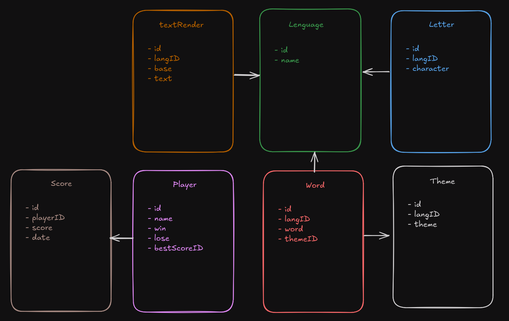
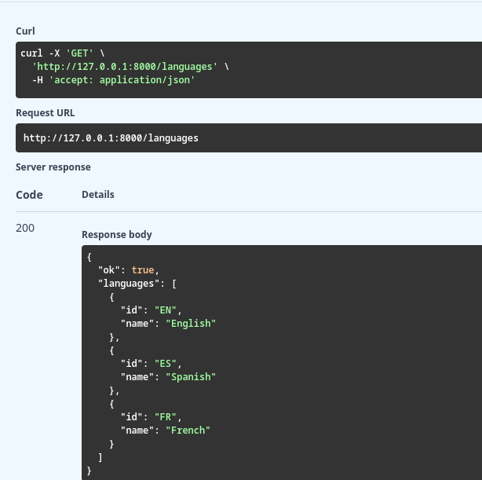
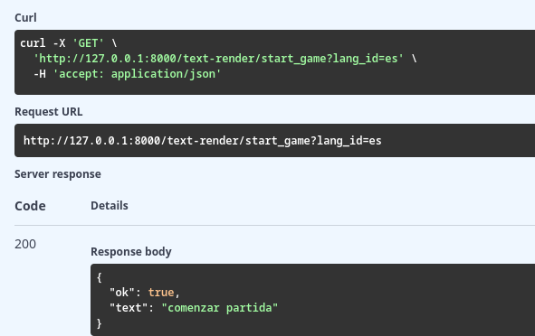
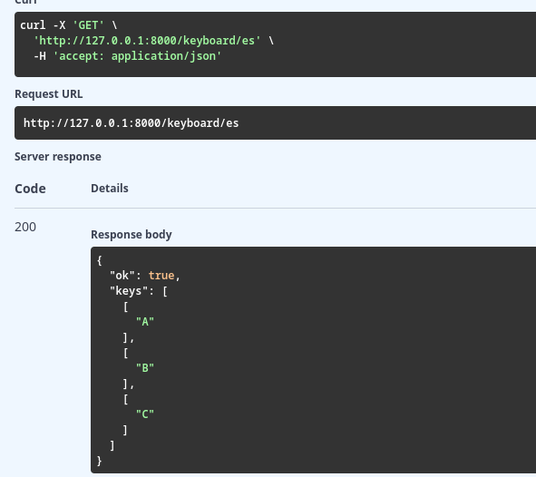
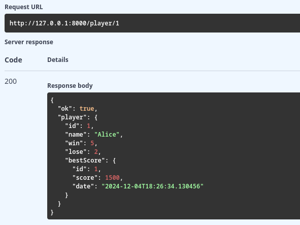
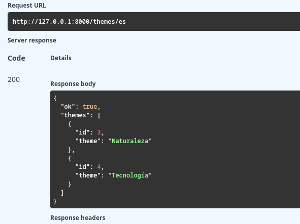
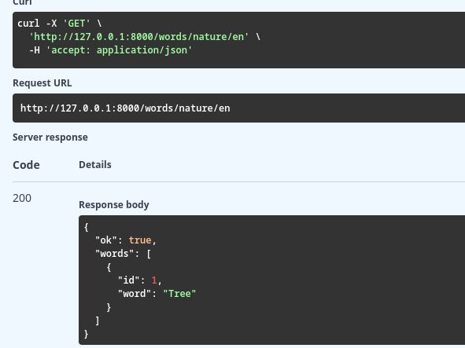
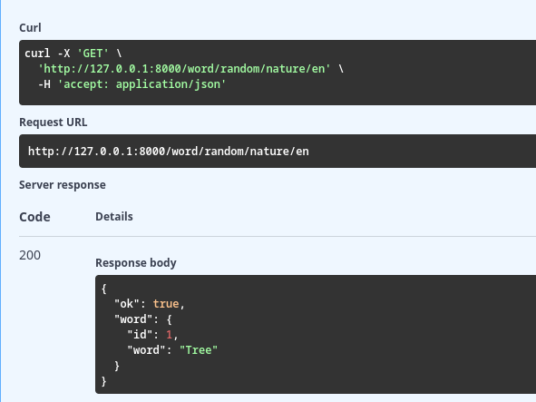

# Activitat 11

---

## Base de datos



## Endpoints

### `GET /languages`
Obtiene la lista de idiomas disponibles.



### `GET /text-render/{base}`
Convierte una palabra base en un texto renderizado según un idioma.

- **Parámetros:**
  - `base` (path, str): La palabra o texto base.
  - `lang_id` (query, str, por defecto `"en"`): El idioma en el que se renderiza el texto.

- **Ejemplo de solicitud:**
  ```http
  GET /text-render/hello?lang_id=es
  ```

- **Respuesta exitosa (200):**
  ```json
    {
    "ok": true,
    "text": "hola"
    }
  ```
    

### `GET /keyboard/{lang_id}`
Obtiene el diseño del teclado para un idioma específico.

- **Parámetros:**
  - `lang_id` (path, str, por defecto `"en"`): El idioma del teclado.

- **Ejemplo de solicitud:**
  ```http
  GET /keyboard/es
  ```

- **Respuesta exitosa (200):**
  ```json
  ["Q", "W", "E", "R", "T", "Y", ...]
  ```

    

### `GET /player/{id}`
Obtiene la información de un jugador por su ID.

- **Parámetros:**
  - `id` (path, int): El identificador único del jugador.

- **Ejemplo de solicitud:**
  ```http
  GET /player/1
  ```

- **Respuesta exitosa (200):**
  ```json
  {
    "ok": true,
    "player": {
        "id": 1,
        "name": "Alice",
        "win": 5,
        "lose": 2,
        "bestScore": {
        "id": 1,
        "score": 1500,
        "date": "2024-12-04T18:26:34.130456"
        }
     }
    }
  ```

  

### `GET /themes/{lang_id}`
Obtiene los temas disponibles en un idioma.

- **Parámetros:**
  - `lang_id` (path, str, por defecto `"en"`): El idioma de los temas.

- **Ejemplo de solicitud:**
  ```http
  GET /themes/en
  ```

- **Respuesta exitosa (200):**
  ```json
  {
    "ok": true,
    "themes": [
        {
        "id": 3,
        "theme": "Naturaleza"
        },
        {
        "id": 4,
        "theme": "Tecnología"
        }
        ]
    }
  ```

    

### `GET /words/{theme}/{lang_id}`
Obtiene una lista de palabras para un tema y un idioma específicos.

- **Parámetros:**
  - `theme` (path, str): El tema de las palabras.
  - `lang_id` (path, str, por defecto `"en"`): El idioma de las palabras.

- **Ejemplo de solicitud:**
  ```http
  GET /words/nature/en
  ```

- **Respuesta exitosa (200):**
  ```json
    {
    "ok": true,
    "words": [
        {
        "id": 1,
        "word": "Tree"
        }
        ]
    }
  ```
    

### `GET /word/random/{theme}/{lang_id}`
Obtiene una palabra aleatoria para un tema y un idioma específicos.

- **Parámetros:**
  - `theme` (path, str): El tema de la palabra.
  - `lang_id` (path, str, por defecto `"en"`): El idioma de la palabra.

- **Ejemplo de solicitud:**
  ```http
  GET /word/random/nature/es
  ```

- **Respuesta exitosa (200):**
  ```json
    {
    "ok": true,
    "words": [
        {
        "id": 1,
        "word": "Tree"
        }
        ]
    }
  ```
    

