# UF2_FASTAPI

---

# Activitat 8

## Probes SWAGGER

- GET:

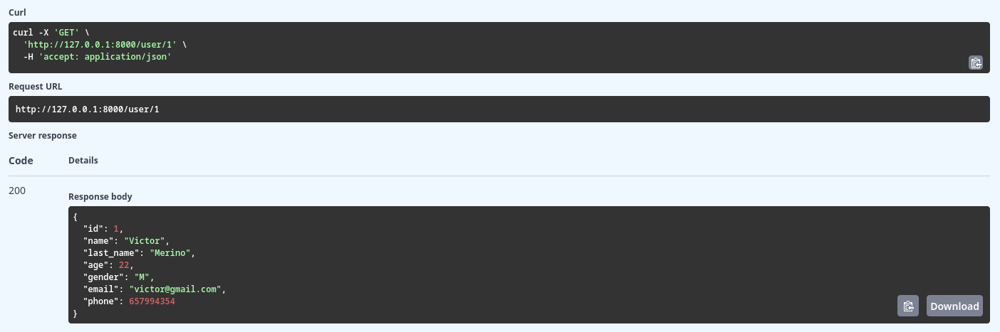

- POST:

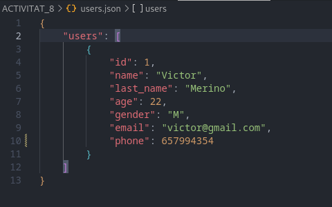

- PUT:

`ID incorrecte`

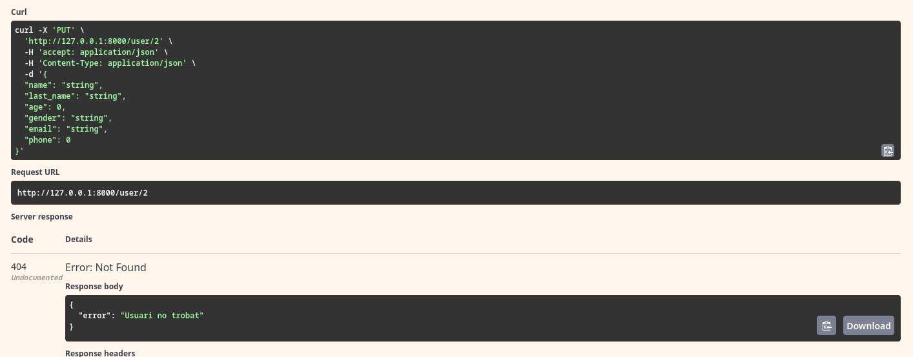

`ID correcte`

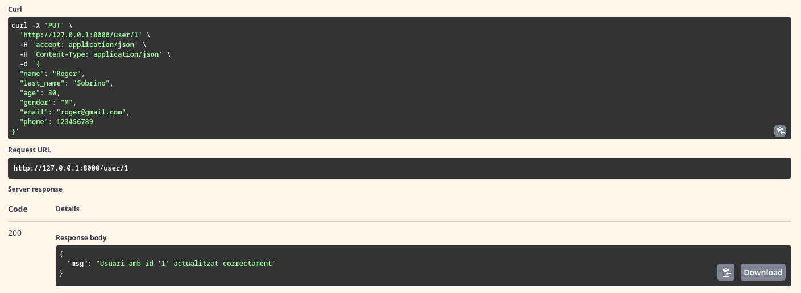

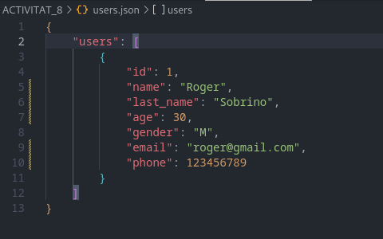

- PATCH

`ID incorrecte`

`ID correcte`

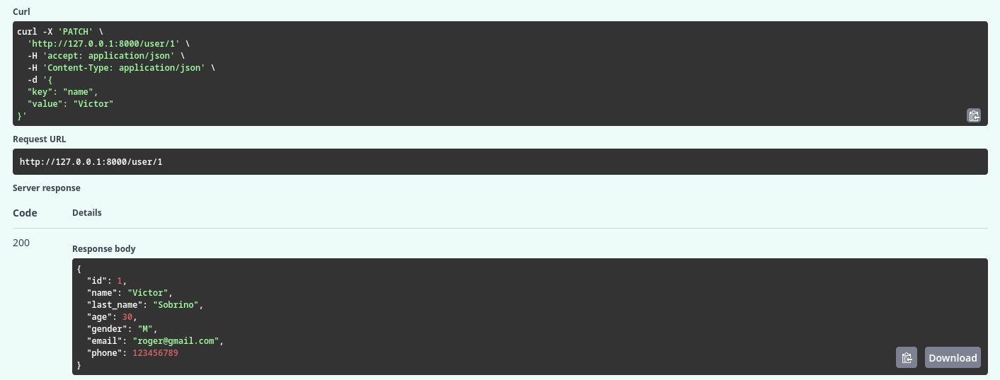

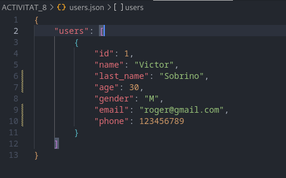

## Probes POSTMAN

- GET:

- POST:

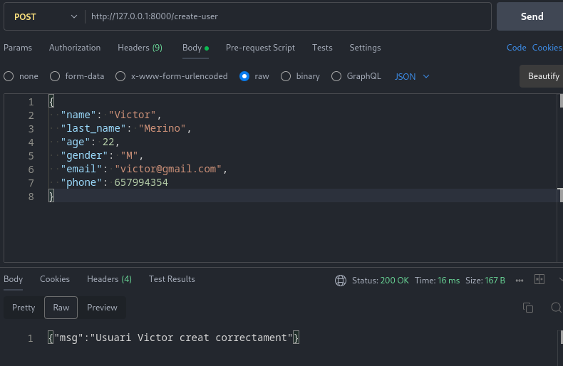

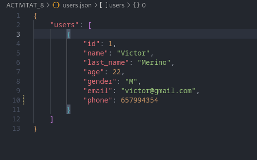

- PUT

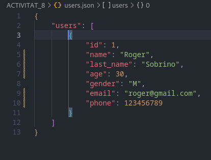

- PATCH

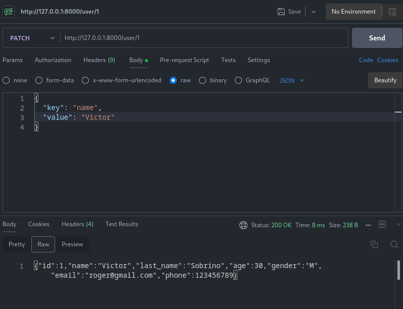

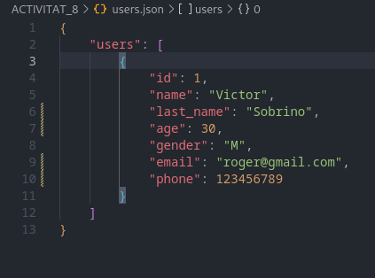