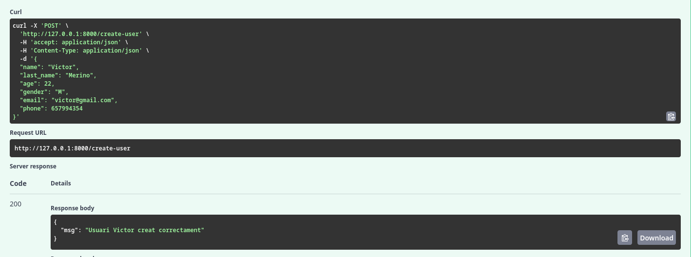
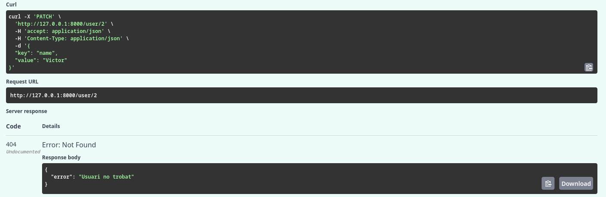
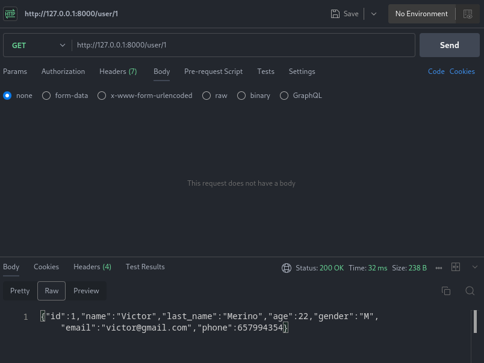
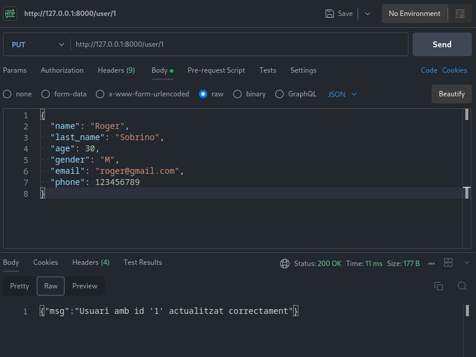

# UF2_FASTAPI

---

# Activitat 8

## Probes SWAGGER

- GET:

- POST:

- PUT:

`ID incorrecte`

`ID correcte`

- PATCH

`ID incorrecte`

`ID correcte`

## Probes POSTMAN

- GET:

- POST:

- PUT

- PATCH

